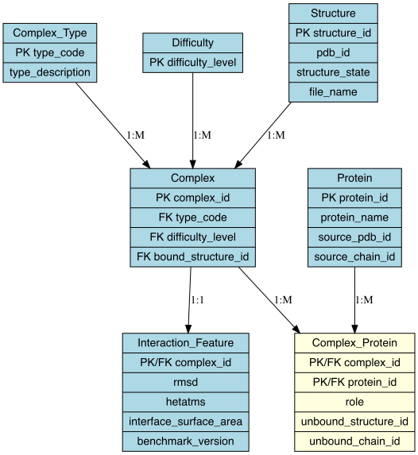

Protein–Protein Interaction Database Design and Query System

[](https://sqlite.org/)
[](https://www.r-project.org/)
[]()

A fully normalized relational database for storing, querying, and analyzing protein–protein interaction data from the **Protein–Protein Docking Benchmark v5.5**.

## Final Database Statistics

| Metric | Value |
|--------|-------|
| **Complexes** | 257 |
| **Proteins** | 489 |
| **Proteins with Sequences** | 489 (100% ✓) |
| **Unique PDB Structures** | 472 |
| **Average Sequence Length** | 1,439 residues |
| **Total Records** | 1,479+ |

## Project Goals

This database enables researchers to:
- ✅ Query complexes by interaction type (AA, EI, ES, ER, OG, OR, OX, AS)
- ✅ Retrieve protein sequences and structural information
- ✅ Filter complexes by docking difficulty (Rigid/Medium/Difficult)
- ✅ Identify proteins that participate in multiple complexes
- ✅ Analyze RMSD and interface surface area measurements

## Docking Difficulty Distribution

| Difficulty | Number of Complexes | Percentage |
|------------|-------------------|-------------|
| **Rigid** | 162 | 63.0% |
| **Medium** | 60 | 23.4% |
| **Difficult** | 35 | 13.6% |

##  Complex Type Distribution

| Code | Description | Count | % |
|------|-------------|-------|---|
| AA | Antibody-Antigen | 55 | 21.4% |
| OX | Others, miscellaneous | 55 | 21.4% |
| EI | Enzyme-Inhibitor | 45 | 17.5% |
| ER | Enzyme with regulatory/accessory | 26 | 10.1% |
| OR | Others, Receptor containing | 24 | 9.3% |
| OG | Others, G-protein containing | 23 | 8.9% |
| ES | Enzyme-Substrate | 17 | 6.6% |
| AS | Antigen-Single domain Antibody | 12 | 4.7% |

## Proteins in Multiple Complexes (Top 5)

| Protein | Complexes | PDB ID |
|---------|-----------|--------|
| Rac GTPase | 5 | 1MH1 |
| Actin | 4 | 1IJJ |
| p300 TAZ2 domain | 3 | 3IO2 |
| Ubiquitin | 3 | 1YJ1 |
| MEF2A | 3 | 3KOV |

## ️ Technologies Used

- **Database**: SQLite
- **ETL & Analysis**: R with packages:
  - DBI, RSQLite (database connection)
  - dplyr, tidyr (data manipulation)
  - bio3d (PDB sequence extraction)
  - ggplot2 (visualization)
  - readxl (Excel import)

##  Database Schema Design

The schema is fully normalized to **Third Normal Form (3NF)**:

### Core Tables

| Table | Purpose | Records |
|-------|---------|---------|
| `complex` | Protein-protein complexes | 257 |
| `protein` | Unique proteins with sequences | 489 |
| `structure` | Bound/unbound PDB records | 733 |
| `complex_protein` | Junction table (many-to-many) | 489+ |
| `interaction_feature` | RMSD, iSA, benchmark version | 257 |
| `complex_type` | Interaction categories (lookup) | 8 |
| `difficulty` | Docking difficulty levels (lookup) | 3 |

### ER Diagram


##  ETL Workflow

### 1. **Extract**
- Loaded `Table_BM5.5.xlsx` (Docking Benchmark v5.5)
- Parsed complex IDs, PDB IDs, chain IDs, and interaction metrics

### 2. **Transform**
- Cleaned and standardized controlled vocabularies
- Separated bound/unbound structures
- Removed duplicate records
- Added sequence data from PDB files

### 3. **Load**
Loaded into SQLite tables in dependency order:
1. Lookup tables (`complex_type`, `difficulty`)
2. `structure` (bound/unbound records)
3. `protein` (unique proteins)
4. `complex` (complexes with foreign keys)
5. `complex_protein` (junction table)
6. `interaction_feature` (measurements)

### Sequence Addition
```r
# Sequences were fetched from PDB files using bio3d package
# Successfully added sequences for all 489 proteins (100% coverage)
